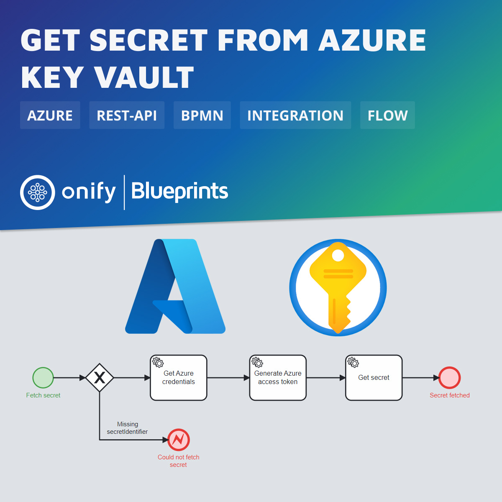

[](https://www.repostatus.org/#wip)


# Onify Blueprint: Get secret from Azure Key vault

[Azure Key Vault](https://azure.microsoft.com/en-us/products/key-vault/) is a cloud service that provides a secure store for secrets. You can securely store keys, passwords, certificates, and other secrets. Azure key vaults may be created and managed through the Azure portal. In this quickstart, you create a key vault, then use it to store a secret.

In this Blueprint we show how to get a secret from Azure Key Vault using a REST API request.



## Requirements

* [Onify Hub](https://github.com/onify/install)
* [Camunda Modeler](https://camunda.com/download/modeler/)

## Included

* 1 x Flow

## Setup

### Microsoft Azure

1. Create your own application (_Integrate any other application you don't find in the gallery (Non-gallery)_) in `Enterprise applications` in Azure AD.
2. Assign Key Vault access policy for the application (see https://learn.microsoft.com/en-us/azure/key-vault/general/assign-access-policy). Secret permissions needs to be set to minmum `Get`.

### Onify

Add the following setting(s) to Onify.

_Replace `<TENANT>`, `<CLIENTID>` and `<CLIENTSECRET>` with correct values._

```json
{
  "key": "_azure_credentials",
  "name": "Microsoft Azure credentials",
  "value": "{\"tenant\":\"<TENANTID>\", \"client_id\":\"<CLIENTID>\", \"client_secret\":\"<CLIENTSECRET>\"}",
  "type": "object",
  "tag": [
    "azure",
    "credentials",
    "frontend"
  ],
  "category": "custom",
  "role": [
    "admin"
  ]
}
```

## Deploy

1. Open the BPMN diagram in Camunda Modeler.
2. Deploy the BPMN diagram (click `Deploy current diagram` and follow the steps).

## Run

This workflow should be run as a _adhoc workflow_ and can be part of another process.
Here is an example how to get a secret using a simple `curl` command.

```bash
curl -X 'POST' \
  'http://localhost:8181/api/v2/my/workflows/run/azure-keyvault-get-secret?timeout=60' \
  -H 'accept: application/json' \
  -H 'authorization: {auth-token}' \
  -H 'Content-Type: application/json' \
  -d '{
"secretIdentifier" : "{vaultBaseUrl}/secrets/{secret-name}/{secret-version}"
}'
```

And here is the result:

```json
{
  "output": {
    "value": "mysecret",
    "contentType": ""
  },
  "status": {
    "statuskey": "complete"
  }
}
```

## Support

* Community/forum: https://support.onify.co/discuss
* Documentation: https://support.onify.co/docs
* Support and SLA: https://support.onify.co/docs/get-support

## License

This project is licensed under the MIT License - see the [LICENSE](LICENSE) file for details.